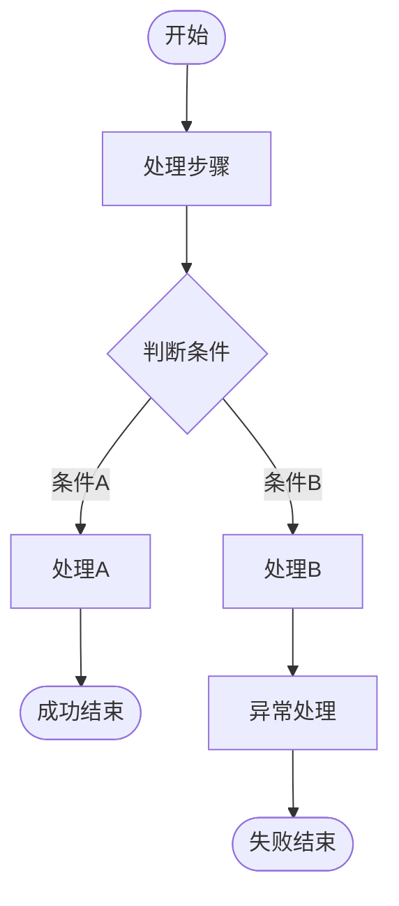

# /prototype-review

根据需求文档创建 HTML 原型，或对已有原型进行审查、完善、标注、流程图制作。

## Usage

```
/prototype-review create <需求文件路径>                    # 根据需求文档创建新原型
/prototype-review create <需求文件路径> --name <项目名>     # 指定项目名（默认从需求提取）
/prototype-review <slug>                                   # 审查已有原型与需求的差距
/prototype-review <slug> --annotate                        # 审查并自动添加标注
/prototype-review <slug> --flows                           # 审查并制作流程图
/prototype-review <slug> --full                            # 审查 + 标注 + 流程图 + 模拟数据补全
```

---

## 模式 A：根据需求创建原型

### Phase 1: 需求分析
1. 读取需求文档（md/txt/doc/pdf）
2. 提取以下信息：
   - **页面清单**：所有需要实现的页面/视图，包括独立页面（登录、欢迎等）
   - **功能点表**：每个模块的功能、操作步骤、交互说明
   - **数据结构**：涉及的数据实体和字段
   - **角色权限**：不同角色看到的不同内容
   - **业务流程**：核心流程、异常流程、自动化流程
   - **非功能性需求**：技术约束、接口要求、部署要求
3. 生成项目 slug（英文，从需求标题提取）

### Phase 2: 项目创建
1. 创建 `website/{slug}/` 目录
2. 生成 `index.json`（项目信息，prompt 存放需求摘要）
3. 生成 `index.html`（原型 HTML）

### Phase 3: 原型 HTML 生成规则

#### 页面结构（严格遵循）

**HTML 骨架必须如下：**

```html
<body>
  <!-- 独立页面：登录/欢迎等，必须带 data-page-name -->
  <div id="loginPage" data-page-name="登录页">
    <!-- 登录表单内容 -->
  </div>

  <!-- 主应用容器 -->
  <div id="app" style="display: none;">
    <!-- 侧边栏导航 -->
    <aside class="sidebar">
      <div class="nav-item active" data-page="map" onclick="showPage('map')">地图管理</div>
      <div class="nav-item" data-page="robots" onclick="showPage('robots')">机器人列表</div>
      <!-- ... -->
    </aside>

    <!-- 每个功能模块对应一个 page-section -->
    <div class="page-section active" id="page-map">...</div>
    <div class="page-section" id="page-robots">...</div>
    <!-- ... -->
  </div>

  <script>
    // 页面名称映射（平台桥接脚本依赖此变量）
    const pageNames = {
      'map': '地图管理',
      'robots': '机器人列表',
      // ...
    };

    function showPage(page) {
      document.querySelectorAll('.page-section').forEach(p => p.classList.remove('active'));
      document.querySelectorAll('.nav-item').forEach(n => n.classList.remove('active'));
      document.getElementById('page-' + page).classList.add('active');
      document.querySelector('.nav-item[data-page="' + page + '"]').classList.add('active');
      document.getElementById('pageTitle').textContent = pageNames[page];
    }
  </script>
</body>
```

**页面识别规范（标注分页必需）：**

| 页面类型 | 要求 | 示例 |
|---------|------|------|
| 标准功能区 | `.page-section` 类 + `id="page-{slug}"` | `<div class="page-section" id="page-map">` |
| 独立页面 | `<body>` 直接子元素 + `data-page-name` 属性 | `<div id="loginPage" data-page-name="登录页">` |
| 登录页 | **必须**加 `data-page-name="登录页"` | 见上 |
| 弹窗/对话框 | **不要**作为 page-section，用 modal overlay | `<div class="modal-overlay">` |

**页面名称优先级**：`data-page-name` 属性 > `pageNames` JS 对象 > `.nav-item` 导航文本 > ID

**强制要求：**
- 独立页面（登录等）**必须**添加 `data-page-name` 属性
- JS 中**必须**定义 `pageNames` 对象，覆盖所有 `.page-section` 页面的中文名
- 默认活动页加 `.active` class
- 登录→主应用的切换用 `style.display` 控制
- **桥接导航兼容**：平台通过 `postMessage` 操控页面切换。当原型有独立页面（如 `loginPage`）+ `#app` 容器双层结构时，`showPage` 函数**必须**同时处理独立页面与 `#app` 的显隐切换：
  ```javascript
  function showPage(page) {
    // 隐藏所有独立页面，显示主应用
    document.querySelectorAll('body > [data-page-name]').forEach(el => el.style.display = 'none');
    var app = document.getElementById('app');
    if (app) app.style.display = '';

    document.querySelectorAll('.page-section').forEach(p => p.classList.remove('active'));
    document.querySelectorAll('.nav-item').forEach(n => n.classList.remove('active'));
    document.getElementById('page-' + page).classList.add('active');
    var nav = document.querySelector('.nav-item[data-page="' + page + '"]');
    if (nav) nav.classList.add('active');
    document.getElementById('pageTitle').textContent = pageNames[page];
  }
  ```

#### 样式规范
- 所有 CSS 在 `<style>` 标签内
- 使用 CSS 变量统一颜色：`--primary`, `--secondary`, `--warning`, `--danger`
- 卡片圆角 16px，阴影 `0 2px 12px rgba(0,0,0,0.08)`
- 按钮 `padding: 12px 24px; border-radius: 10px`
- 页面切换动画：`.page-section.active { display: block; animation: fadeIn 0.4s ease; }`
- 页面隐藏：`.page-section { display: none; }`

#### z-index 分层规范（标注兼容性）
平台在原型 iframe 内注入标注 marker（`position: fixed; z-index: 200`）。原型的 z-index 必须遵循以下分层，避免标注被覆盖或弹窗被标注遮挡：

| 层级 | z-index 范围 | 用途 | 示例 |
|------|-------------|------|------|
| 普通内容 | 0–50 | 卡片、表格、表单、地图元素 | `.card { z-index: 1 }` |
| 固定布局 | 50–100 | 侧边栏、顶栏、底部导航 | `.sidebar { z-index: 100 }` |
| **标注层（平台保留）** | **199–200** | **marker + 目标高亮** | 平台自动注入，原型勿用 |
| 弹窗/浮层 | 300–999 | 下拉菜单、tooltip、 popover | `.dropdown { z-index: 500 }` |
| 模态框 | 1000+ | 对话框、确认弹窗、抽屉 | `.modal { z-index: 1000 }` |
| 全局通知 | 1100+ | Toast、全局提示 | `.toast { z-index: 1100 }` |
| 全屏覆盖 | 9999 | 全屏查看器、锁屏 | `.fullscreen { z-index: 9999 }` |

**禁止事项：**
- 不要使用 `z-index: 199` 或 `z-index: 200`（标注保留）
- 不要用 `* { ... !important }` 等通配符覆盖标注 marker 样式
- 不要在 `body` 上设置 `transform`/`filter`/`will-change`（会破坏 `position: fixed` 定位）

#### 模拟数据要求
**关键原则**：如果需求中存在不同分支/状态，模拟数据必须覆盖所有情况：
- **多状态同时展示**：任务列表同时出现"待执行""执行中""已完成""已失败"
- **正常与异常并存**：机器人列表同时有"在线""充电中""故障""离线"
- **边界值**：电量 5%/50%/95%，速度正常/慢速/低速
- **空状态与满状态**：空列表引导文案、有数据时的列表内容

#### 交互实现
- 所有按钮有 click 事件处理，至少用 Toast 反馈
- 表单有基础验证（必填、字数限制等），不合规时有提示
- Tab 切换、弹窗开关等交互需完整实现
- 页面间无死链接，所有导航项都可跳转

### Phase 4: 标注生成
创建时即为关键元素生成标注，写入 `index.json` 的 annotations 数组。

**⚠️ 标注生成前置步骤（必须按顺序执行）：**

**步骤 1：枚举所有页面、弹窗和按钮**
在生成任何标注之前，先从 HTML 中提取完整的可标注元素清单：

```
1. grep 所有页面：page-section（标准页面）+ data-page-name（独立页面）→ 得到页面列表
2. grep 所有弹窗：modal-overlay 或 .modal → 得到弹窗列表，每个弹窗记录：
   - 弹窗 ID（如 #saveMapModal）
   - 触发按钮（哪个按钮 onclick 调用了 openModal）
   - 所属页面（弹窗 DOM 在哪个 page-section 内，或 #app 层级）
   - 弹窗内容摘要（表单字段、按钮）
3. grep 所有 Tab 切换组：每组 Tab 的选项和对应的 content panel
4. grep 所有可操作元素（以下全部必须标注）：
   a. <button> 标签
   b. class 含 btn 或 button 的元素（如 .btn-primary、.tool-btn、.task-btn、.ctrl-btn、.map-control-btn、.action-btn）
   c. 带 onclick 属性的任意元素（<div onclick=...>、<span onclick=...>）
   d. <input type="submit"> 和 <input type="button">
   → 输出完整按钮清单，按页面分组，标注序号
```

**步骤 2：生成标注清单**
按以下顺序逐页生成标注，确保不遗漏：
1. 每个页面的 Tab 切换项（每个 Tab 一个标注）
2. **步骤 1.4 中的每个按钮**（按页面分组逐一标注，不可跳过）
3. 每个页面内的关键数据展示区（卡片/表格/列表/状态面板）
4. **每个弹窗至少一个标注**（用弹窗容器 ID 作为 selector）
5. 表单验证规则和分支逻辑
6. 搜索框、筛选下拉、滑块等输入控件

**步骤 3：自查清单**
生成完毕后逐项确认：
- [ ] 弹窗列表中的**每个弹窗**是否都有标注？
- [ ] 每个触发弹窗的按钮标注中是否注明了"点击弹出 xxx 弹窗"？
- [ ] Tab 组中的**每个 Tab 项**是否都有标注？
- [ ] 每个标注是否都有 `selector` 字段（非 `x`/`y`）？
- [ ] **对比按钮清单**：grep `<button ` 的总数 vs 标注中覆盖的按钮数，差距 > 5 则有遗漏
- [ ] **对比弹窗清单**：grep `modal-overlay` 的总数 vs 标注中覆盖的弹窗数，每个弹窗至少 1 条

**标注数据结构：**
```json
{
  "id": "唯一ID",
  "markerNumber": 1,
  "selector": "#elementId",
  "description": "标注说明",
  "page": "map",
  "createdAt": 1700000000000,
  "updatedAt": 1700000000000
}
```

**字段说明：**
- `selector`：**必填**，CSS 选择器，平台通过 `container.querySelector(selector)` 定位目标元素来放置 marker。**不要使用 `x`/`y` 坐标**，平台不支持坐标定位。
- `page`：**必填**，标注所属页面的 ID（如 `"map"`、`"robots"`、`"loginPage"`）

**selector 编写规则：**
- 优先使用 ID 选择器：`#loginForm`、`#mapCanvas`
- 有 `data-*` 属性的使用属性选择器：`[data-robot-name='G1-001']`、`[data-task-id='2']`
- Tab 按钮使用 `.tab-class:nth-of-type(N)` 或 `.tab-class[data-tab='xxx']`：`.task-tab:nth-of-type(1)`、`.logs-tab[data-tab='user']`
- 列表/表格区域使用容器 ID：`#logs-user .data-table`、`#robotBindList`
- 弹窗元素指向弹窗内的 DOM：`#addPointModal .modal-body`
- **禁止使用纯文本内容选择器**（如 `:contains()`），不兼容 querySelector
- **selector 必须在对应 page 的 HTML 中能匹配到可见元素**，否则 marker 不会显示

**标注覆盖要求（逐按钮标注——零遗漏原则）：**

平台对每个按钮独立渲染 marker（小按钮 marker 外置不遮挡操作区）。标注必须覆盖以下所有元素：

| 元素类型 | 标注内容 | 示例 |
|---------|---------|------|
| **每个 `<button>`** | 功能说明、触发条件、点击后行为 | "新建任务：打开任务创建弹窗，需填写任务名称和执行机器人" |
| **每个 class 含 btn/button 的元素** | 同上，包括 .btn、.tool-btn、.task-btn、.ctrl-btn 等 | "删除点位：删除当前选中的地图元素" |
| **每个带 onclick 的元素** | 即使是 div/span，只要有 onclick 就必须标注 | "机器人卡片：点击查看详情或跳转到运行监控" |
| **每个 `<input type="submit/button">`** | 表单提交行为、验证规则 | "登录按钮：验证用户名密码后进入主应用" |
| **弹窗/对话框** | 弹出时机、表单字段、确认/取消后续、关闭行为 | "编辑弹窗：点击编辑按钮弹出，预填当前数据，确认后更新列表" |
| **Tab 切换** | 每个 Tab 的名称、内容范围、切换后数据变化 | "Tab「进行中」：筛选 status=running 的任务，空状态显示引导文案" |
| **分支逻辑** | 条件判断点、每条分支走向和结果 | "状态判断：电量>20% 正常调度，≤20% 自动召回充电" |
| **状态切换** | 标签含义、触发条件、界面变化 | "开关切换：启用/禁用机器人，禁用后从调度池移除" |
| **表单验证** | 校验规则、不合规提示、按钮禁用条件 | "任务名称：必填，2-20字，为空时提交按钮禁用" |
| **关键数据展示** | 指标含义、异常阈值、颜色变化条件 | "电量条：>60% 绿色，20-60% 黄色，<20% 红色闪烁" |
| **空状态/异常状态** | 触发条件、引导操作 | "列表为空：显示「暂无任务」+ 新建按钮引导" |
| **搜索框/筛选/滑块** | 输入控件的行为、筛选逻辑 | "搜索框：按名称实时模糊匹配过滤列表" |

**允许合并的情况（减少冗余标注）：**
- 同一页面内连续的同类型操作按钮（如列表中每一行的编辑/删除），可合并为一条标注描述操作列
- 工具栏中性质相同的一组按钮（如放大/缩小/重置），可合并为一条标注
- 弹窗内的取消按钮无需单独标注，在弹窗标注中描述即可

**Tab 切换标注规则：**
- 每个 Tab 项本身需要一个标注（说明 Tab 名称和筛选逻辑）
- Tab 内的关键按钮和数据展示也需要标注
- `page` 字段仍使用 Tab 所属的页面 ID（Tab 切换不改变 page）
- 标注说明中注明"Tab「xxx」内"

**弹窗标注规则（强制——弹窗是隐藏 DOM，极易遗漏）：**
- HTML 中的弹窗（`.modal-overlay`）默认 `display:none`，不在页面可见区域内，**必须通过 grep 主动发现**
- **每个弹窗至少一个标注**，selector 用弹窗容器 ID（如 `#saveMapModal`、`#editTaskModal`）
- 触发按钮的标注说明中注明"点击弹出 xxx 弹窗"，并描述弹窗内表单字段和操作按钮
- 弹窗内如果有复杂表单（超过3个字段），可拆分为多个标注分别描述
- 弹窗的确认/取消/关闭行为在标注中说明
- `page` 字段使用弹窗所属页面的 ID
- **自查方法**：标注生成后，用 `grep -c 'modal-overlay' index.html` 统计弹窗数量，确认标注中覆盖了所有弹窗

**标注 page 字段取值规则：**
- 登录页的标注：`page: "loginPage"`
- 标准 page-section 的标注：`page: "map"` / `page: "robots"` 等（不含 `page-` 前缀）
- 弹窗内的标注：`page` 与弹窗所属页面一致
- 必须与 HTML 中的页面 ID 一致

### Phase 5: 流程图制作
为项目制作流程图，使用 Mermaid 语法生成，保存到 `website/{slug}/images/`。

**流程图生成规则：**
1. 使用 Mermaid flowchart 语法
2. 每个流程图保存为 `.md` 文件（含 Mermaid 代码块）
3. 文件命名规范：

| 类型 | 文件名 | 必须包含的分支 |
|------|--------|---------------|
| 认证流程 | flow-auth.md | 成功、失败、超时、锁定、退出 |
| 核心业务流程 | flow-core.md | 成功、失败、超时路径 |
| 状态生命周期 | flow-state-{entity}.md | 所有状态、转换、终态 |
| 异常处理 | flow-error.md | 检测→重试→恢复/降级/告警 |
| 自动化流程 | flow-auto.md | 触发条件、执行、中断恢复 |

**Mermaid 模板：**



**分支要求：**
- 每个判断节点标明条件、不允许悬空
- 失败分支说明后续处理（重试/降级/告警/人工介入）
- 状态节点使用 `([圆形])` 表示，处理步骤使用 `[矩形]`
- 异常路径使用红色样式 `:::error`，成功路径使用绿色 `:::success`

**附带文字说明**：流程图下方写状态转换表、验证规则、边界情况

---

## 模式 B：审查已有原型

### Phase 1: 读取素材
1. 读取 `website/{slug}/index.html`（原型）
2. 读取 `website/{slug}/index.json`（项目信息和已有标注）
3. 查找需求文档（项目中或 index.json 的 prompt 字段）

### Phase 2: 逐项对比（输出差距报告）

#### A. 页面完整性
- 需求中每个页面/视图是否在原型中都有对应
- 侧边栏/导航项是否与需求结构一致
- 是否有需求提到的独立页面被遗漏
- 独立页面是否添加了 `data-page-name` 属性
- `pageNames` 对象是否覆盖所有页面

#### B. 页面识别规范检查
- 所有 `<body>` 直接子元素的独立页面是否有 `data-page-name`
- 所有 `.page-section` 的 ID 是否遵循 `page-{slug}` 格式
- `pageNames` 对象的 key 是否与页面 ID 一致
- 默认活动页是否正确标记 `.active`

#### B2. 桥接导航兼容性检查
平台通过注入桥接脚本操控 iframe 内的页面切换。以下情况会导致平台右侧页面导航失效：

- **独立页面→page-section 跳转不通**：原型有 `loginPage`（独立页面）+ `#app`（含 `.page-section`）两层结构时，未登录时 `#app` 为 `display:none`。桥接脚本导航到 `.page-section` 时必须同时隐藏所有独立页面并显示 `#app`。
- **检查方法**：用 Playwright 打开原型 iframe，在未登录状态下通过 `postMessage({type:'smilex-navigate', page:'xxx'})` 测试每个页面导航。
- **修复方法**：确认桥接脚本（`src/components/prototype/SandboxRenderer.tsx` 中的 `BRIDGE_SCRIPT`）的 `smilex-navigate` 处理器包含：
  ```javascript
  // 导航到 .page-section 时
  _standalone.forEach(function(s){s.style.display='none';});
  var app=document.getElementById('app');if(app)app.style.display='';
  // 导航到独立页面时（已有逻辑）
  el.style.display='';
  var app=document.getElementById('app');if(app)app.style.display='none';
  ```

#### C. 功能点逐项对照
- 需求表格每行功能在原型中的实现情况
- 表单字段验证规则、操作按钮交互反馈

#### D. 标注完整性
- 每个页面是否至少有 2 个标注
- **按钮覆盖率**：grep `<button ` 总数 vs 标注中覆盖按钮数，覆盖率应 > 90%
- **class 含 btn/button 的元素覆盖率**：同上
- **带 onclick 的元素覆盖率**：同上
- **Tab 切换项**是否标注（每个 Tab 的筛选逻辑和内容范围）
- **弹窗覆盖率**：grep `modal-overlay` 总数 vs 标注中覆盖弹窗数，每个弹窗至少 1 条
- 标注的 `page` 字段是否与 HTML 页面 ID 一致
- 登录页标注的 page 是否为 `"loginPage"`
- 弹窗内的标注 `selector` 是否指向弹窗 DOM 内的元素
- 搜索框、筛选下拉、滑块等输入控件是否有标注

#### E. 模拟数据覆盖
- 多状态展示、异常场景、边界值、空状态

#### E2. z-index 合规检查
- 是否有元素占用 z-index 199–200（标注保留层）
- 弹窗/模态框 z-index 是否 ≥ 300（避免被标注遮挡）
- 是否有 `* { !important }` 通配符可能覆盖标注样式
- `body` 上是否有 `transform`/`filter`/`will-change`（破坏 fixed 定位）

#### F. 流程图完整性
- 核心流程是否有对应流程图
- 异常分支是否都有覆盖

#### G. 易遗漏的设计盲区
- 离线/网络中断、多设备冲突、并发排队、紧急停止
- 充电/自动恢复、状态机完整性、权限角色、交互细节

### Phase 3: 输出差距报告

```markdown
## 原型审查报告：{项目名}

### 差距总览
| # | 差距 | 优先级 | 类型 |
|---|------|--------|------|

### 页面规范检查
| 检查项 | 状态 | 说明 |
|--------|------|------|
| 独立页面 data-page-name | ✅/❌ | |
| pageNames 覆盖度 | ✅/❌ | |
| page-section ID 格式 | ✅/❌ | |
| 桥接导航兼容性 | ✅/❌ | 独立页面↔page-section 切换时 #app 显隐是否正确 |
| z-index 合规 | ✅/❌ | 无元素占用 199–200，弹窗 ≥ 300 |

### 标注覆盖检查
| 页面 | 标注数 | 覆盖关键元素 | 缺失项 |
|------|--------|-------------|--------|

### 详细说明
#### 差距 N: xxx
- **需求描述**: ...
- **当前原型状态**: ...
- **建议修复**: ...

### 模拟数据检查
- [ ] 已覆盖 / 缺失
```

### Phase 4: 标注/流程图/补全
同模式 A 的 Phase 4-5，根据 `--annotate` / `--flows` / `--full` 参数执行。

审查时如发现页面缺少 `data-page-name` 或 `pageNames` 条目，应自动补全并写回 HTML。

审查时如发现桥接导航不通（独立页面→page-section 跳转后页面空白），应检查并修复桥接脚本（`src/components/prototype/SandboxRenderer.tsx`）中的 `smilex-navigate` 处理器，确保导航到 `.page-section` 时同时隐藏独立页面并显示 `#app`。

---

## 通用规范

### 平台边界原则
- **平台功能**（不要放进 HTML 原型）：标注/预览切换、流程图工具、项目管理、AI 生成
- **原型功能**（在 HTML 中实现）：业务页面 UI、业务导航表单、业务数据展示操作

### index.json 格式
```json
{
  "slug": "project-slug",
  "name": "中文项目名",
  "prompt": "需求摘要文本",
  "annotations": [
    {
      "id": "唯一ID",
      "markerNumber": 1,
      "selector": "#elementId",
      "description": "标注说明",
      "page": "map",
      "createdAt": 1700000000000,
      "updatedAt": 1700000000000
    }
  ],
  "mode": "preview",
  "createdAt": 1700000000000,
  "updatedAt": 1700000000000
}
```

**标注定位机制**：平台通过 `iframe.contentDocument.querySelector(selector)` 找到目标 DOM 元素，然后在其附近放置 marker。如果 selector 匹配不到元素，marker 不会显示。**不支持 `x`/`y` 坐标定位。**

### 文件存储结构
```
website/
  {project-slug}/
    index.html      # 原型（单文件，CSS+JS 内联）
    index.json      # 项目元数据 + 标注数据
    images/         # 流程图（Mermaid .md 文件）
      flow-auth.md
      flow-core.md
```

### 技术约束
- 单 HTML 文件，CSS 在 `<style>`，JS 在 `<script>`
- 渲染在 `<iframe sandbox="allow-scripts allow-same-origin allow-forms">`
- 页面切换用 `.page-section` + `.active` class
- 独立页面用 `data-page-name` 标识 + `style.display` 切换
- 不依赖外部文件，无外部 API 调用
- 目录名用英文 slug，中文项目名存 index.json
- 所有标注必须包含 `page` 字段和 `selector` 字段（CSS 选择器，用于 querySelector 定位）
- **标注使用 `selector` 定位，不是 `x`/`y` 坐标**——平台通过 `querySelector(selector)` 找到目标元素放置 marker
